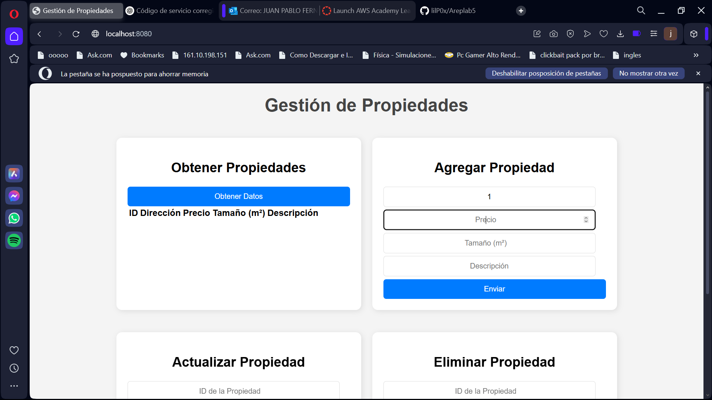
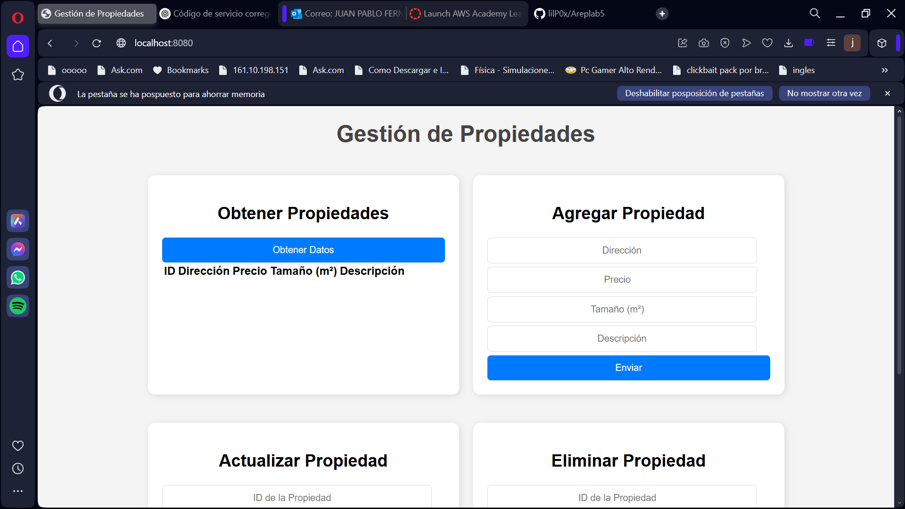
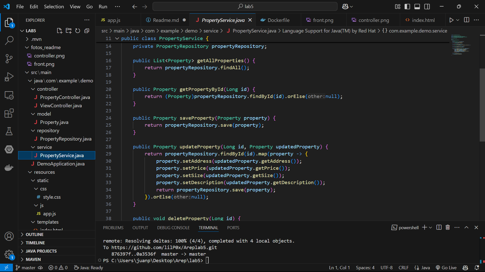

# Gestión de Propiedades

## Funcionalidades

- **Obtener propiedades:** Muestra una lista de propiedades almacenadas en la base de datos.
- **Agregar propiedad:** Permite registrar una nueva propiedad con dirección, precio, tamaño y descripción.
- **Actualizar propiedad:** Modifica los datos de una propiedad existente mediante su ID.
- **Eliminar propiedad:** Borra una propiedad utilizando su ID.

## Estructura del Proyecto

```
/lab5
│── src/main/java/com/example/lab5
│   ├── controller
│   │   ├── PropertyController.java  
│   │   ├── ViewController.java 
│   ├── model
│   │   ├── Property.java 
│   ├── repository
│   │   ├── PropertyRepository.java  
│   ├── service
│   │   ├── PropertyService.java  
│   ├── DemoApplication.java  
│
│── src/main/resources
│   ├── static
│   │   ├── css/style.css
│   │   ├── js/app.js  
│   ├── templates
│   │   ├── index.html  
│   ├── application.properties  
│
│── target  # Archivos compilados del proyecto
│── pom.xml  # Dependencias y configuración de Maven
│── README.md  # Documentación del proyecto
```


## Instalación y ejecución

1. Clona el repositorio:
   ```bash
   git clone https://github.com/lilP0x/Areplab5.git
   cd lab5
   ```

2. Construye el proyecto con Maven:
   ```bash
   mvn clean install
   ```

3. Ejecuta la aplicación:
   ```bash
   mvn spring-boot:run
   ```

4. Accede a la aplicación en el navegador:
   ```
   http://localhost:8080
   ```

   

## Tecnologías Utilizadas

- Java 17
- Spring Boot
- Maven
- H2 Database (o MySQL, según configuración)
- HTML, CSS, JavaScript


## Codigo implementado

# Controller 




# Service 



# Model


